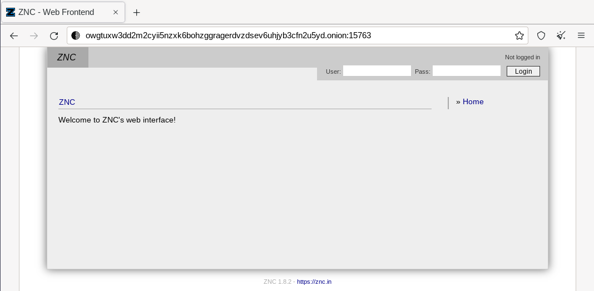
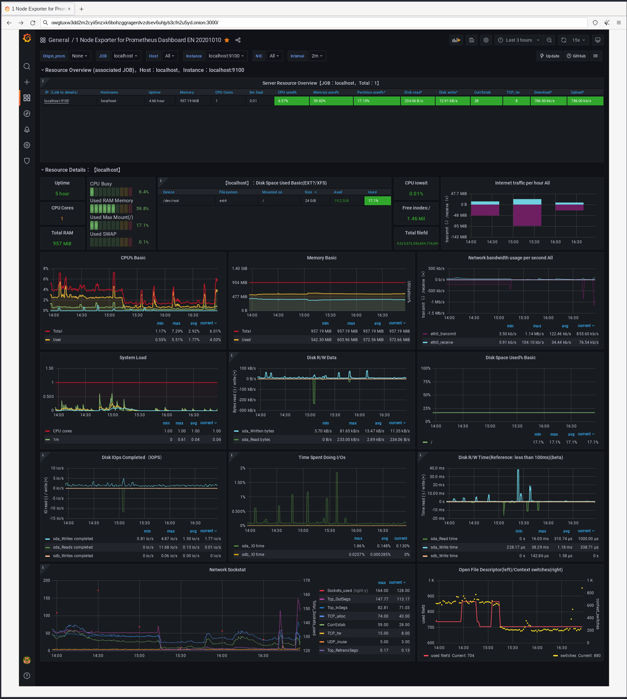

# About

This repository contains Terraform, Packer, and Ansible configuration to deploy an Arch Linux Linode instance that hosts a ZNC IRC bouncer that uses Tor, an Onion service to access the bouncer webadmin and a Tor middle relay.

# Pre requisites

- A [Linode API Token](https://www.linode.com/docs/products/tools/linode-api/guides/get-access-token/) with **Read/Write** access for the **Images** and **Linodes** scopes.
- The following packages:
  - [ansible](https://archlinux.org/packages/community/any/ansible/)
  - [packer](https://archlinux.org/packages/community/x86_64/packer/)
  - [terraform](https://archlinux.org/packages/community/x86_64/terraform/)

# Deploying the bouncer

## Build image

1. To export Packer variables:

```bash
set +o history # unset bash history
unset HISTFILE # unset zsh history

export PKR_VAR_linode_token=<linode token>
export PKR_VAR_user=<instance user>
export PKR_VAR_ssh_keys=<url with public keys>
export PKR_VAR_control_pass=<tor's control password>
```

2. To install packer plugins:

```bash
packer init packer
```

3. To build an image:

```bash
packer build packer
```

The following variables are shown in STDOUT and are required for the next steps:

1. **znc_cert_fingerprint**
1. **liberachat_fingerprint**
1. **oftc_fingerprint**
1. **hidden_service**
1. **linode_image**

<div align="center">


</div>

## Deploy image

1. To export Terraform variables:

```bash
set +o history # unset bash history
unset HISTFILE # unset zsh history

export TF_VAR_linode_token=<your linode token>
export TF_VAR_image=<linode image id>
```

2. To deploy an instance

```bash
terraform -chdir=terraform init
terraform -chdir=terraform apply
```

3. To connect to the instance:

```bash
ssh <user>@<ip> -p <port>
```

You're required to set-up your password upon first login:

<div align="center">


</div>

First login:

<div align="center">


</div>

## Access ZNC's webadmin

- To get the Onion Service URL:

```bash
cat /var/lib/tor/hidden_service/hostname
```

- To get ZNC's port

```bash
sed --quiet --expression '/Port/p' /var/lib/znc/.znc/configs/znc.conf
```

Access ZNC's webadmin using the onion service and the port, (ex. `http://owgtuxw3dd2m2cyii5nzxk6bohzggragerdvzdsev6uhjyb3cfn2u5yd.onion:15763/`):



# Connecting to the bouncer

The following stpes are done in an IRC client like WeeChat.

## Add SSL certificates for [SASL External](https://en.wikipedia.org/wiki/Simple_Authentication_and_Security_Layer) authentication

### Adding the LiberaChat network:

1. To connect to LiberaChat directly:

```bash
/server add liberachat-direct irc.libera.chat/6697 -ssl
/set irc.server.liberachat-direct.nicks <liberachat_nick>
/save
/connect liberachat-direct
```

2. To add the SSL certificate to LiberaChat:

```bash
/msg NickServ cert add <liberachat_fingerprint>
```

3. To connect to LiberaChat using ZNC:

```bash
/server add liberachat-znc <ip_address>/6697 -ssl -username=<znc_user>/liberachat -password=<znc_pass>
/set irc.server.liberachat-znc.ssl_fingerprint <znc_cert_fingerprint>
/save
/connect liberachat-znc
```

3. To use SASL External:

```bash
/query *sasl Mechanism EXTERNAL
```

4. To accept LiberaChat's SSL fingerprint:

Move to the ***status** buffer, then add the certificate:

```bash
/znc AddTrustedServerFingerprint <ssl_fingerprint>
```

5. To use clientbuffer:

```bash
/query *clientbuffer AddClient <client_name>
/disconnect -all
/set irc.server.liberachat-znc.username "<irc_user>@<client_name>/liberachat"
```

### Adding the OFTC network:

1. To connect to OFTC:

```bash
/server add oftc-direct irc.oftc.net/6697 -ssl
/set irc.server.oftc.nicks <liberachat_nick>
/save
/connect oftc-direct
```

2. To add the SSL certificate to OFTC:

```bash
/msg NickServ cert add <oftc_fingerprint>
```

3. To use SASL External:

```bash
/server add oftc-znc <ip_address> -ssl -username=<znc_user>/oftc -password=<znc_pass>
/set irc.server.oftc-znc.ssl_fingerprint <znc_cert_fingerprint>
/save
/connect oftc-znc
/query *sasl Mechanism EXTERNAL
```

4. To accept LiberaChat's SSL fingerprint:

Move to the ***status** buffer, then add the certificate:

```bash
/znc AddTrustedServerFingerprint <ssl_fingerprint>
```

5. To use clientbuffer:

```bash
/query *clientbuffer AddClient <client_name>
/disconnect -all
/set irc.server.oftc-znc.username "<irc_user>@<client_name>/oftc"
```

## Monitoring

The following services are accessible from the Tor network:

| Service                  | Port |
| -----------              | ---- |
| grafana                  | 3000 |
| prometheus               | 9090 |
| prometheus-node-exporter | 9100 |

Access a service (ex. Grafana) using the Onion Adress and the port, ex (**owgtuxw3dd2m2cyii5nzxk6bohzggragerdvzdsev6uhjyb3cfn2u5yd.onion:3000/**):


